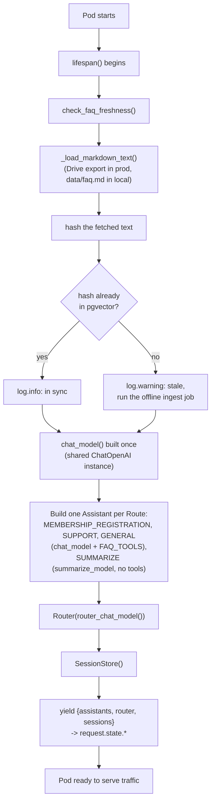
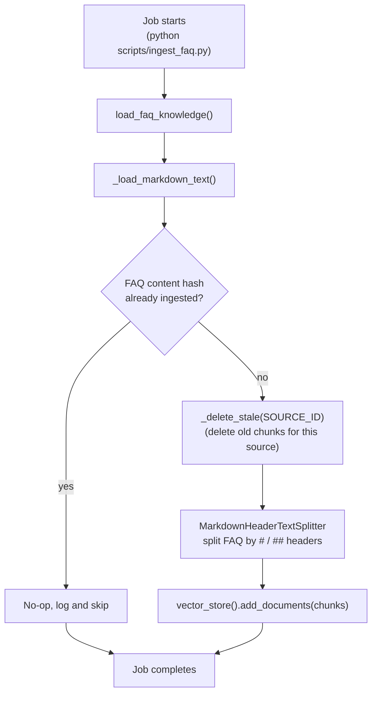
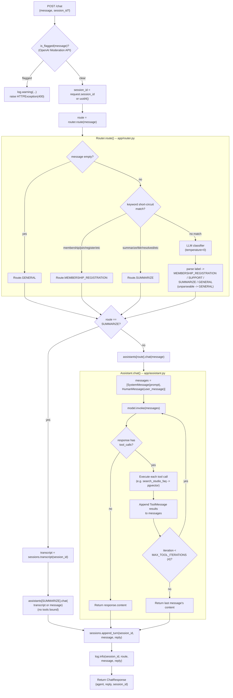
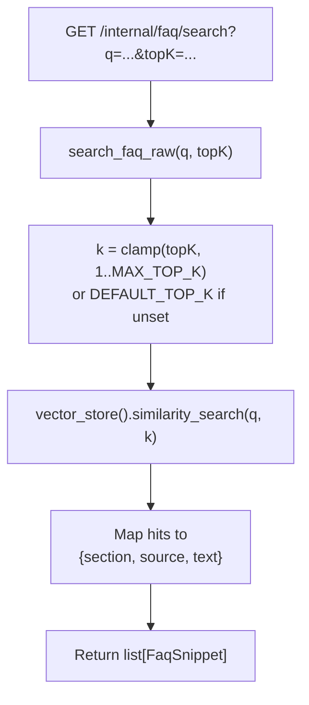

# Workflows

Detailed flowcharts for each of studio-chatbot's code paths. See the root
[README.md](../README.md) for architecture/deployment context — this doc is the
step-by-step "what actually happens" companion to it.

## 1. App startup (`app.main.lifespan`)

Runs once per pod, before any request is served. Note this is a **read-only freshness
check**, not ingestion — see workflow 1b for where embedding actually happens.

Notes:
- `check_faq_freshness()` never writes to pgvector — it only warns. This keeps
  embedding compute (and its Drive-read dependency) out of the request-serving pod's
  startup critical path; see workflow 1b for the actual ingest.
- `chat_model()`, `router_chat_model()`, `summarize_model()`, `vector_store()`,
  `embedding_model()` are all `@lru_cache`d in `app/ai_config.py` — built once per process,
  reused across every request and every Assistant.

## 1b. Offline FAQ ingestion (`scripts/ingest_faq.py`)

Runs as a Kubernetes `Job` (`helm/templates/ingest-job.yaml`, off by default — see
README's Maintainability Next Step), not from the app pod.

Notes:
- Idempotency is by **whole-document content hash**, not per-chunk — any FAQ edit
  re-deletes and re-ingests every chunk for that source, not just the changed section.
- Triggered manually today (`helm upgrade ... --set ingestJob.enabled=true`); a
  `CronJob` on a schedule, or a webhook off a Drive change notification, are the
  natural next steps once drift-checking in workflow 1 proves the signal is useful.

## 2. `POST /chat`

The main request path. Every step below runs synchronously per request.

Notes:
- Moderation runs **before** `session_id` resolution and routing — a flagged message never
  reaches the session store, the router, or any model call.
- `SUMMARIZE` is the only route that ignores the literal incoming message for its actual
  model input — it summarizes `sessions.transcript(session_id)` instead, since the trigger
  word itself ("resolved", "tldr") carries no content.
- The tool-calling loop (`Assistant.chat`) is bounded by `MAX_TOOL_ITERATIONS`, not a retry
  mechanism — see README's "Retry transient model-call failures" Next Step for the actual
  retry gap (transient API errors on `.invoke()` itself, not this loop).
- Every turn is logged in one line (`session_id`, `route`, `message`, `reply`) — see
  README's "Observability" section for what's *not* covered (metrics, tracing, alerting).

## 3. `GET /internal/faq/search`

The non-agentic path — no LLM, no router, no session involvement.

Notes:
- `search_faq_raw()` is the same function the `search_studio_faq` LangChain tool calls from
  inside the `Assistant.chat()` loop in workflow 2 — this endpoint exists to inspect
  retrieval quality/results directly, independent of what an agent does with them (used by
  `evals/test_ragas_faq.py`'s context-precision checks too).
- No auth today — see README's "Keycloak-based JWT authentication" Next Step.
